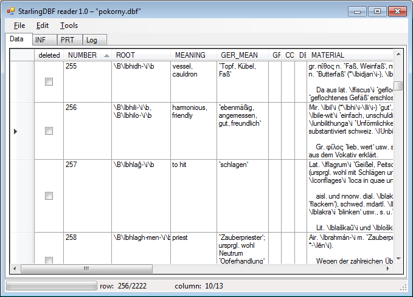

# Accessing Starling Databases

* [What is Starling?](#starling)
* [Starling database structure](#dbf)
* [StarlingDBF reader](#reader)
  * [Source code](#code)
  * [Windows executable](#binary)

This project provides documentation on the file structure of Starling databases and contains code for a tool to view and extract data from them.

## <a name="starling"></a>What is Starling?
According to the [Starling website](http://starling.rinet.ru/program.php?lan=en):

>STARLING is a software package designed by Sergei Starostin for various types of linguistic text and database processing, including handling of linguistic fonts in the DOS and WINDOWS operating systems, operations with linguistic databases and Internet presentation of linguistic data.

Starling seems to have been first developed in the 1980s and its database file structure still reflects this fact. Furthermore it was crafted in a time before Unicode and therefore uses its own character encodings. It also incorporates a custom markup format.

Despite its relatively widespread use in certain linguistic circles, it is a virtually undocumented piece of software with a user interface that is far from intuitive. In order to have access to data sets that are only available in Starling format, without having to depend on Starling itself, this project contains information on its database file structure, as well as a tool to read Starling databases.

## <a name="dbf"></a>Starling database structure
The Starling database file (DBF) structure is based on the [dBase&nbsp;III](https://en.wikipedia.org/wiki/DBase#dBase_III) format. It has been largely reverse engineered by [prof.dr.&nbsp;Brouwer](http://www.win.tue.nl/~aeb/natlang/charsets/starling-charset.html) and the documentation provided here is an extension of his work.

A description of the Starling database file structure can be found in the document entitled [Accessing Starling Databases](doc/starling-dbf.pdf).

## <a name="reader"></a>StarlingDBF reader
A small tool to read and export the data contained within Starling databases is the ```StarlingDBF reader```. It can be used to:

* Open a Starling database (DBF) file
* View its contents and its metadata (such as print settings) as Unicode text
* Perform Unicode normalization
* Correct the nesting and/or replace the notation of markup tags
* Export as Unicode to a [CSV](https://en.wikipedia.org/wiki/Comma-separated_values) file



### <a name="code"></a>Source code
The source code is written in C# and included as a Microsoft Visual C# Express&nbsp;2010 solution.

### <a name="binary"></a>Windows executable
A windows executable can be found [here](Visual%20C%23%20Express%202010%20code%2FStarlingDBF%20Converter%2Fbin%2FRelease%2FStarlingDBF%20reader.exe).